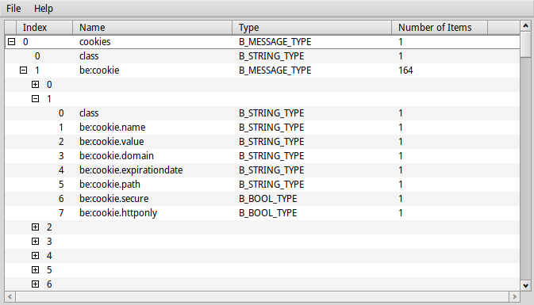

# Kottan

An inspector for archived BMessage objects for the Haiku operating system 

## Prerequisites
Kottan should compile under any version of Haiku that is not too ancient. 
On the 32bit version please remember to issue *setarch x86* before compiling.

## Compiling 
Compiling is done using the makefile engine supplied with Haiku. A simple *make* compiles the code,
and *make bindcatalogs* adds the translations. For now, only English and German are available. 

After that, you can run *Kottan* from the generated *objects.xxxxx* directory. 
## Trivia
In case anyone is wondering: Kottan is named after a somewhat whacky police inspector in an austrian TV series of the same name from the 1980ies. 
